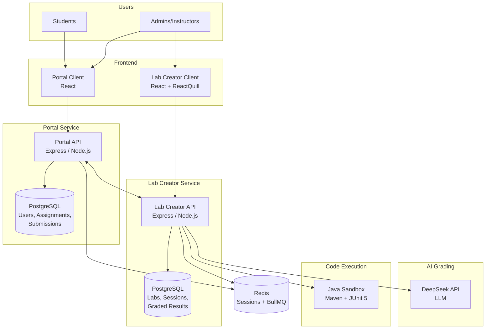

# Application Architecture Diagram

## Mermaid Diagram (renders on GitHub, VS Code with Mermaid extension, or paste into mermaid.live)

```mermaid
flowchart TB
    subgraph Users
        S[Students]
        A[Admins/Instructors]
    end

    subgraph Frontend
        PC[Portal Client<br>React]
        LC[Lab Creator Client<br>React + ReactQuill]
    end

    subgraph Portal Service
        PA[Portal API<br>Express / Node.js]
        PDB[(PostgreSQL<br>Users, Assignments,<br>Submissions)]
    end

    subgraph Lab Creator Service
        LA[Lab Creator API<br>Express / Node.js]
        LDB[(PostgreSQL<br>Labs, Sessions,<br>Graded Results)]
    end

    subgraph AI Grading
        DS[DeepSeek API<br>LLM]
    end

    subgraph Code Execution
        SB[Java Sandbox<br>Maven + JUnit 5]
    end

    R[(Redis<br>Sessions + BullMQ)]

    S --> PC
    A --> PC
    A --> LC

    PC --> PA
    LC --> LA

    PA --> PDB
    LA --> LDB

    PA <--> LA

    LA --> DS
    LA --> SB
    LA --> R
    PA --> R
```
